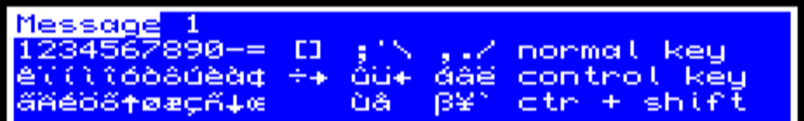

# The Quill for Sinclair QL - the program.
## Versions

There is know to exist version A00, A01, A03,A07 and A08 of the QL version, but only A07 can be found on internet.

A03 and A07, show copyright dated 23 October 1986 by Huw H. Powell

The version number do not match other platforms and some capabilities of the QL version can only be found C versions, the CP/M Version or even in PAW.

## Capabilities
Free space available on start (on bare Sinclair QL) > 53760 bytes, memory increase if you have memory expansion.

Text resolution: 37 columns by 22 rows, mode 4 or mode 8 colors (same columns/rows)

Use, like BBC an Oric, * instead of _

The executable file shall be run with
'''
ex file
'''
when leave the game, the screen is not clean, so last typed remain.

using lresp to load the executable game work, but game is unable to leave, going back to start the adventure after put garbage in screen.

### Sound/Color Actions:
* SOUND
* BORDER / PAPER / INK 
* CLS

Ctr, Shift and number or symbol can generate internacional leters as per next table:

Alt + 0-7 change color of ink.
Alt + 8 inverse video, 
Alt + 9 Go back to normal colors.
Shift + Enter Change of line

To change the color of background, change ink to paper desired, inverse and change ink again

## Extra functions

System messages ca be modified, and aditional messages can be used (with new contact SYSMESS)

Aditional condacts:
* SYSMESS
* RAMLOAD
* RAMSAVE
* AUTOG / AUTOD / AUTOW / AUTOR
* DROPALL

Flags
* 60 Score
* 61 LSB of Turn Counter
* 62 MSB of Turn Counter

## Missing functions

As early version of QUILL process and response tables shall put all conditions first and them all actions, is not possible to mix conditions in middle of actions.

There are missing information

* Blinking
* external functions

## Confirmed Not have
NOTEQ / DESTROYED / CREATED of BBC are not available.
EXTERN / SOUND /SCREEN / TEXT / NEWLINE / BELL not available.
COPYOF / COPYOO / COPYFO / COPYFF not available
/ISDESC / ISAT / DESC not available

## Compatibility

Is compatible with memory upgardes
Is compatible with disk and other storage mediums

is Incompatible with Minerva Rom (not load database, other pending test)

## Not tested yet

what happend with colors in mode 4.

## Porting from other platforms.

On most platform flags 30,31 & 32 store score, and 2-byte number of turns, in the QL this is managed by flags 60,61 & 62, so contacts need to be corrected.

Sound and beep contacts are not translated so need to be corrected.

there is a tipical "_ _ isdesc done" line in status table to avoid event just after description of new locations, as isdesc is not available on QL, this shall be comment or replaced.
